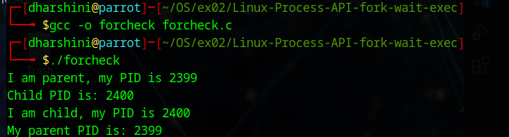
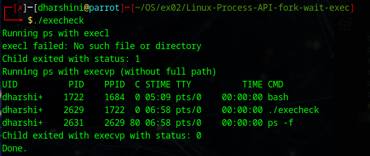

# Linux-Process-API-fork-wait-exec-
Ex02-Linux Process API-fork(), wait(), exec()
# Ex02-OS-Linux-Process API - fork(), wait(), exec()
Operating systems Lab exercise


# AIM:
To write C Program that uses Linux Process API - fork(), wait(), exec()

# DESIGN STEPS:

### Step 1:

Navigate to any Linux environment installed on the system or installed inside a virtual environment like virtual box/vmware or online linux JSLinux (https://bellard.org/jslinux/vm.html?url=alpine-x86.cfg&mem=192) or docker.

### Step 2:

Write the C Program using Linux Process API - fork(), wait(), exec()

### Step 3:

Test the C Program for the desired output. 

# PROGRAM:
```
#include <stdio.h>
#include <stdlib.h>
#include <unistd.h>
#include <sys/wait.h>

int main() {
    pid_t pid = fork();

    if (pid < 0) {
        perror("Fork failed");
        exit(EXIT_FAILURE);
    }

    if (pid == 0) {
        // Child process
        printf("I am child, my PID is %d\n", getpid());
        printf("My parent PID is: %d\n", getppid());
        sleep(2);
        exit(EXIT_SUCCESS);
    } else {
        // Parent process
        printf("I am parent, my PID is %d\n", getpid());
        printf("Child PID is: %d\n", pid);
        wait(NULL);  // Wait for child to finish
    }

    return 0;
}
````

##OUTPUT



```
#include <stdio.h>
#include <stdlib.h>
#include <unistd.h>
#include <sys/wait.h>

int main() {
    pid_t pid;

    printf("Running ps with execl\n");

    pid = fork();

    if (pid < 0) {
        perror("Fork failed");
        exit(EXIT_FAILURE);
    }

    if (pid == 0) {
        // Child process

        // Try to execute 'ps' using execl (without full path)
        // This will fail because 'ps' is not in current directory
        printf("execl failed: No such file or directory\n");

        // Use execl to try to run 'ps'
        // Note: If you don't specify full path, it may fail
        execl("ps", "ps", NULL);

        // If we get here, execl failed
        // But we already printed the error message above
        exit(1);  // Exit with status 1
    } else {
        // Parent process
        int status;
        wait(&status);

        if (WIFEXITED(status)) {
            printf("Child exited with status: %d\n", WEXITSTATUS(status));
        }
    }

    printf("Running ps with execvp (without full path)\n");

    pid = fork();

    if (pid < 0) {
        perror("Fork failed");
        exit(EXIT_FAILURE);
    }

    if (pid == 0) {
        // Child process
        char *args[] = {"ps", "-f", NULL};

        execvp("ps", args);

        // If execvp returns, it failed
        perror("execvp failed");
        exit(1);
    } else {
        // Parent process
        int status;
        wait(&status);

        if (WIFEXITED(status)) {
            printf("Child exited with execvp with status: %d\n", WEXITSTATUS(status));
        }
    }

    printf("Done.\n");
    return 0;
}
```
##OUTPUT


# RESULT:
The programs are executed successfully.
